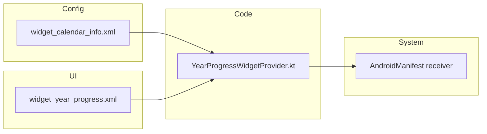
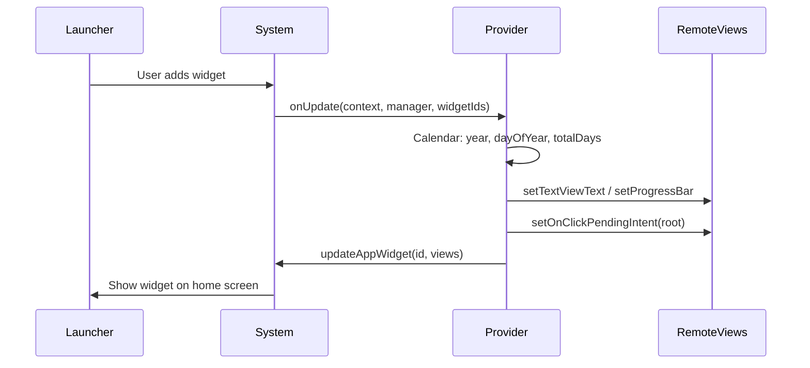

# Year Progress Widget – How It’s Built & UX Ideas

## How We Created the Widget

Android home-screen widgets use the **App Widget API**. They are **native Android** (Kotlin + XML), not React Native. Here’s the flow.

### 1. Pieces involved

- **Widget metadata** (`res/xml/widget_calendar_info.xml`): Declares size, layout, update interval, and description. The launcher reads this when the user adds the widget.
- **Widget layout** (`res/layout/widget_year_progress.xml`): The UI (title, days passed/left, progress bar, percentage). Only views supported by **RemoteViews** are allowed (e.g. `LinearLayout`, `TextView`, `ProgressBar`).
- **Provider** (`YearProgressWidgetProvider.kt`): A `BroadcastReceiver` that:
  - Receives `APPWIDGET_UPDATE` (when the widget is added or when `updatePeriodMillis` fires).
  - Computes year progress (total days, days passed, days left, percentage) using `Calendar`.
  - Builds a **RemoteViews** from the layout and sets text/progress with `setTextViewText`, `setProgressBar`.
  - Registers a **PendingIntent** on the root view so tapping the widget opens the app.
- **Manifest**: Registers the provider with `APPWIDGET_UPDATE` and points to the metadata XML.

### 2. Data flow

- **onUpdate** runs when the widget is first added and roughly every `updatePeriodMillis` (we use 24h).
- All UI updates go through **RemoteViews**: you can’t hold references to real Views; the system applies the RemoteViews on the host process (launcher).

### 3. Why native and not React Native?

Widgets are drawn by the **home screen process**. The system only allows a fixed set of layouts and actions (PendingIntents). React Native runs inside your app process and can’t directly drive the widget UI, so the widget is implemented in Kotlin + XML and only opens the app on tap (or other PendingIntents you add).

---

## iOS app widget

- **Widget Extension** in `ios/YearProgressWidget/`:
  - **YearProgressWidget.swift**: WidgetKit `Widget` with `TimelineProvider` (year, days passed/left, percentage), SwiftUI view, and `.widgetURL` so tapping opens the app.
  - **Info.plist**: `NSExtension` with `com.apple.widgetkit-extension`.
- **Xcode**: `YearProgressWidgetExtension` target in `ios/wallpe.xcodeproj`, embedded in the main app via “Embed Foundation Extensions”.
- **URL scheme**: `wallpe://year-progress` in the main app’s Info.plist so the widget can open the app when tapped.
- **Sizes**: `.systemSmall` and `.systemMedium`. Timeline reloads at start of next day.

---

## Interactive / UX Improvements We Can Add

Widgets are limited: no text input, no custom gestures inside the widget. “Interactive” here means **tap actions**, **extra info**, and **visual clarity**.

### 1. Different tap actions (high impact)

- **Whole widget** → Open app (already done).
- **“Days left” row** → Open app to a “Year progress” or “Goals” screen (e.g. via Intent extra or deep link).
- **“Percentage” or progress bar** → Share a short “Year progress” message (e.g. “2025 is 12.9% done”) via `Intent.ACTION_SEND` with a share PendingIntent.

Implementation: give the “days left” and “percentage” (or progress bar) their own `android:id`, and in the provider call `setOnClickPendingIntent(id, pendingIntent)` with different intents (e.g. activity with extra, or share intent).

### 2. Extra copy for engagement (medium impact)

- **Next milestone**: e.g. “25% in 5 days” or “Halfway in 136 days”. Compute the next round number (25, 50, 75, 100) and days until that percentage; show one line in the layout and set it in the provider.
- **Motivational line**: e.g. “Make the rest count” or “X% done – keep going.” Rotate a few strings by day-of-year so it doesn’t feel static.

Implementation: add one or two `TextView`s to the layout and set their text in `updateAppWidget` using the same `Calendar` math.

### 3. “Refresh” affordance (medium impact)

- A small “Refresh” or icon area that, when tapped, triggers an immediate widget update (request `AppWidgetManager.updateAppWidget` for that widget id). This gives the user a sense of control.

Implementation: add a view (e.g. `ImageView` or `TextView`) with a PendingIntent that sends a broadcast your provider listens for (e.g. `ACTION_APPWIDGET_UPDATE` or a custom action), and in `onReceive` call `onUpdate` for that widget.

### 4. Visual polish (low–medium impact)

- **Theming**: use `?android:attr/colorPrimary` or your app’s accent for the progress bar and key text so the widget feels part of the app.
- **Rounded progress bar**: already using a rounded background; you can add a custom drawable for the progress bar (e.g. rounded corners) in `res/drawable` and set it on the ProgressBar in the layout.
- **Slightly larger touch target**: ensure padding/min height so “days left” and “percentage” rows are easy to tap if you add separate click actions.

### 5. Multiple sizes (optional)

- Provide a 2×1 “compact” layout (e.g. only percentage + progress bar) and a 4×2 “full” layout (current one + milestone/motivation). In `widget_calendar_info.xml` you can point to the default layout; for different sizes you’d use `AppWidgetManager.getAppWidgetOptions()` in the provider and pick a layout (or use `android:widgetFeatures` and alternative layouts in XML). Improves UX for users who want a smaller widget.

---

## Summary

- **How we created it**: appwidget-provider XML + RemoteViews layout + `AppWidgetProvider` that computes year progress and updates the widget; receiver registered in the manifest; one PendingIntent on the root to open the app.
- **More interactive UX**: add separate tap actions (e.g. open app to a specific screen, share), “next milestone” and short motivational text, an explicit “Refresh” tap target, and optional visual/theming and multi-size layout improvements.

If you tell me which of these you want first (e.g. “different tap actions + next milestone”), I can outline the exact code changes step by step.

---

## iOS Widget – Re-enabling After "Can't Run App"

If the main app was changed so it **no longer builds or embeds** the Year Progress widget (to fix "can't run app" after adding the widget), the widget extension target still exists but is not built when you run **wallpe**. To run the app with the widget again: add **YearProgressWidgetExtension** as a dependency of **wallpe** and add an "Embed Foundation Extensions" phase that embeds **YearProgressWidgetExtension.appex** in Xcode, or ask to "re-add the Year Progress widget to the iOS app build" to restore this in `project.pbxproj`.
